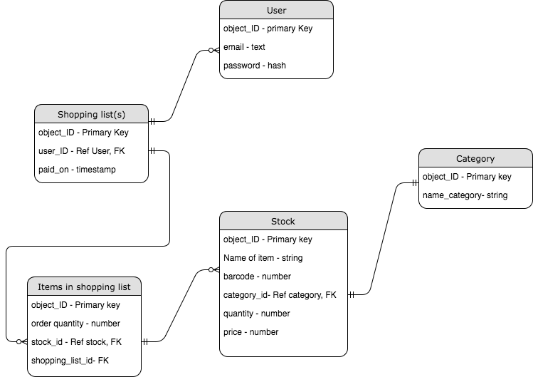

# Project 3: Smartest Mart

Start your shopping experience with us : https://smartestmart.herokuapp.com


## What you need to make it work..

### Built with
* [Ruby version 2.4.2](https://www.ruby-lang.org/en/)
* [Rails version 5.1.4](http://weblog.rubyonrails.org/2016/6/30/Rails-5-0-final/)
* [jQuery](http://jquery.com/)
* [QuaggaJS](https://serratus.github.io/quaggaJS/)
* [Bootstrap](https://v4-alpha.getbootstrap.com/)
* [Devise](https://github.com/plataformatec/devise )
* [stripe](https://stripe.com/)
* [has_scope](https://github.com/plataformatec/has_scope)
* [Action mailer](http://guides.rubyonrails.org/action_mailer_basics.html)


### To start...
* Fork the repo and run ```bundle install```
* Initialise your database by running ```rails db:create``` ```rails db:migrate```
* To start your server, run ```rails s``` and open localhost:3000 on your web browser

### Entity Relationship Diagram


### Models
* User
* Stock
* Shoppinglist
* Item
* Category

### Deployment tool
We used Heroku to deploy our application.

### Key functions
The app allows a user to search and shop for items by scanning an item's barcode with a computer's camera. The scanning function also allows the administrator to quickly add a stock in the database. Key words can also be searched through the search bar.

Users are also able to quickly browse items through categories.

Multiple shopping lists can also be created for different occasions to suit various shopping needs. These lists can be reused for similar occasions in the future.

A user can also view their past purchases by looking into their transaction history.

### Problems and how we solved them..
* Getting a compatible barcode scanner. We solved it by researching for rails compatible scanner and testing on a separate project file before including it into rails. The camera/scanner also persisted through the app, this was fixed by rendering JS on one page.
* We needed to track paid history and thought we needed to add another model. However, we decided to include another column in our shopping list model.
* Instead of having just one cart for payment purposes, we allowed each shopping list to be checked out and paid.
* Guest could not create and check out shopping list so we decided to scale down and directed guests to register/login before shopping.

### Future improvements
* To allow guest(s) to make purchases without registering as a user
* Extend and optimise the same functionalities to a mobile phone
* Increase the precision of the camera barcode
* Include more filtering options (i.e by price range, brand and recipes)
* To scale up by adding another model to store our transaction history
